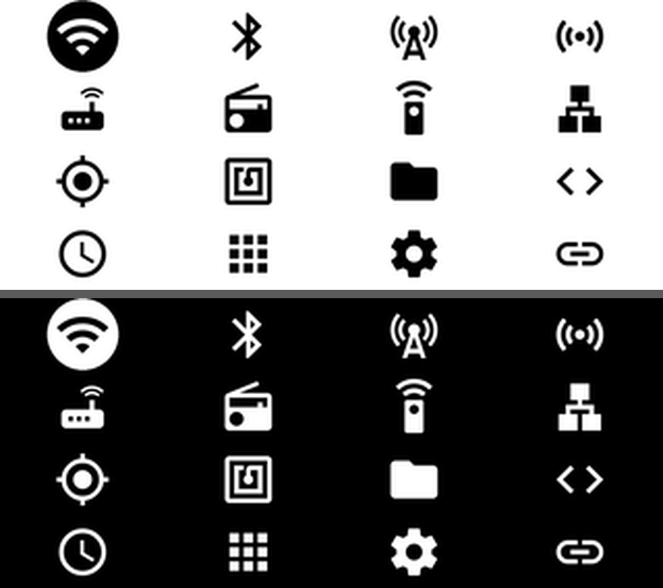
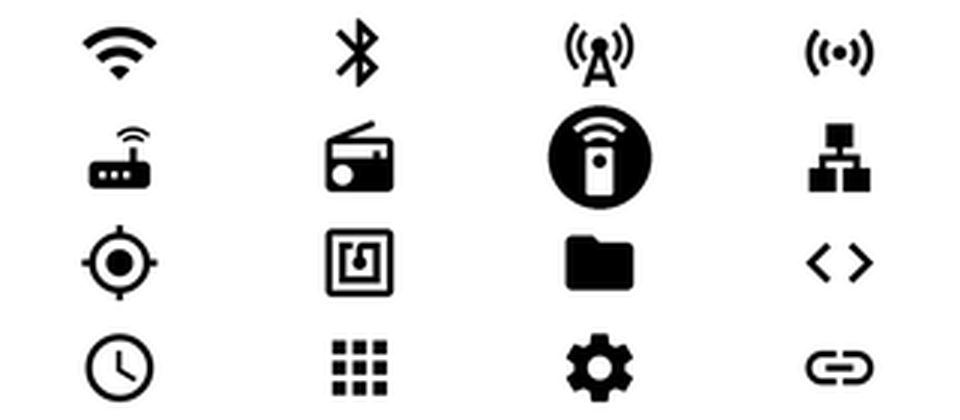
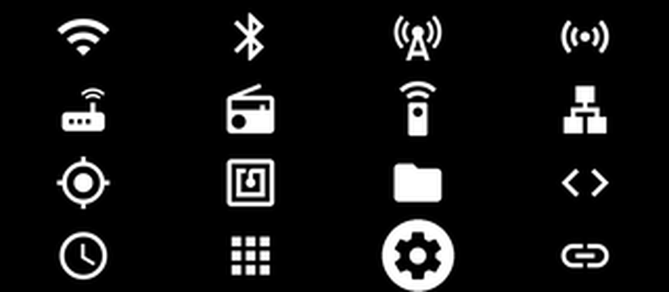
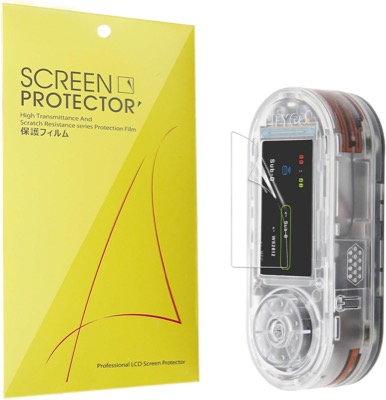
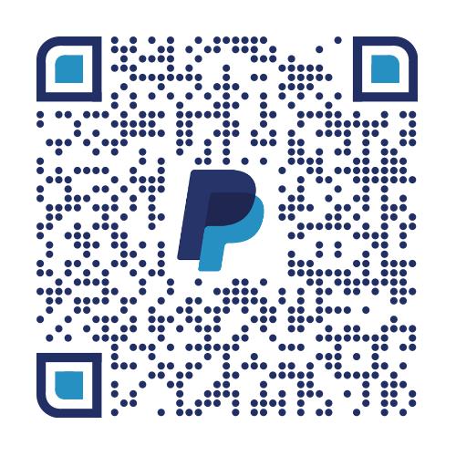

# ⬛ Grille — Bruce Theme

  

> **EN** — A clean, minimal **grid** UI theme for the **[Bruce firmware](https://github.com/BruceDevices/firmware)** on the LilyGO T-Embed CC1101 (320×170). All menus are shown at once as a **4×4 grid** of professional Material icons; the current menu is highlighted — inverted inside a solid circle. Light and dark variants included.

> **FR** — Un thème UI **grille** minimaliste et propre pour le firmware **[Bruce](https://github.com/BruceDevices/firmware)** sur LilyGO T-Embed CC1101 (320×170). Tous les menus affichés d'un coup en **grille 4×4** d'icônes Material pro ; le menu courant est mis en avant — inversé dans un rond plein. Variantes claire et sombre incluses.

## 🎨 Deux variantes

| Variante | Pictos | Sélection |
|---|---|---|
| **`Grille`** | noir sur blanc | picto **blanc dans un rond noir** |
| **`Grille_Dark`** | blanc sur noir | picto **noir dans un rond blanc** |

| Light | Dark |
|---|---|
|  |  |

## ✨ Détails

- 🔲 **Grille 4×4** = les 16 entrées du menu visibles en permanence.
- 🎯 Menu courant **surligné** (inversé dans un rond plein) — pas de texte, ultra lisible.
- 🧩 Icônes **[Material Icons](https://github.com/google/material-design-icons)** de Google (style pro) : WiFi, Bluetooth, RF, NRF, LoRa, FM, IR, Ethernet, GPS, RFID, Files, Scripts, Clock, Others, Config, Connect.

## 📦 Contenu

Chaque variante : **4 tailles** × **16 PNG** + `.json`.

| Dossier | Image | Écran cible |
|---|---|---|
| `105px/` | 240×105 | M5StickC Plus (240×135) |
| `140px/` | 320×140 | **T-Embed CC1101 / Cardputer (320×170)** |
| `180px/` | 320×180 | écrans ~320×210 |
| `192px/` | 320×192 | écrans ~320×222 |

> ℹ️ **Barre d'état** — Bruce réserve **30 px en haut**. Taille = hauteur écran − 30 → **T-Embed CC1101 = `140px`**.

## 🚀 Installation

1. Copie **`Grille`** et/ou **`Grille_Dark`** à la racine de la carte SD.
2. Sur l'appareil : **Config → UI Theme → `Grille/140px/Theme_Grille.json`** (ou `Grille_Dark/140px/Theme_Grille_Dark.json`).
3. Via WiFi : **Files → WebUI**, upload le dossier, puis sélectionne le `.json`.

## 🛒 Matériel / Hardware

Accessoires utiles pour ce projet — liens affiliés Amazon :

|  |  |  |
|:---:|:---:|:---:|
| 🛡️ **[T-Embed CC1101 screen protector](https://www.amazon.com/dp/B0GXB24SRR?linkCode=ll2&tag=koua29-20&ref_=as_li_ss_tl)** Lamshaw, film TPU ×6 | 📡 **[433 MHz SMA antenna (2-pack)](https://www.amazon.com/dp/B0C1FCZM94?linkCode=ll2&tag=koua29-20&ref_=as_li_ss_tl)** Antenne sub-GHz pour la radio CC1101 | 💾 **[SanDisk 64 GB microSD (2-pack)](https://www.amazon.com/dp/B0B7NVMBPL?linkCode=ll2&tag=koua29-20&ref_=as_li_ss_tl)** Pour les thèmes, scripts et captures Bruce |

En tant que Partenaire Amazon, je réalise un bénéfice sur les achats remplissant les conditions requises. · As an Amazon Associate I earn from qualifying purchases.

## 🎨 Crédits

- Thème par **koua29**. Icônes : **[Material Icons](https://github.com/google/material-design-icons)** de Google — licence **Apache 2.0**.
- Tourne sur l'excellent **[Bruce firmware](https://github.com/BruceDevices/firmware)**.

## ☕ Un café ?

## 📄 Licence

Assets du dépôt sous **MIT** (voir [LICENSE](LICENSE)). Icônes Material sous **Apache 2.0**.
